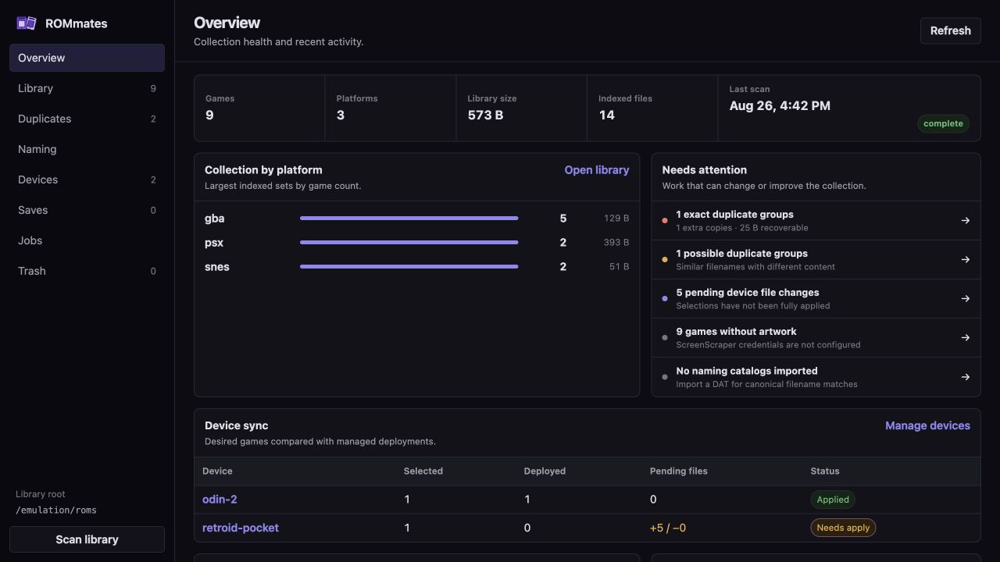
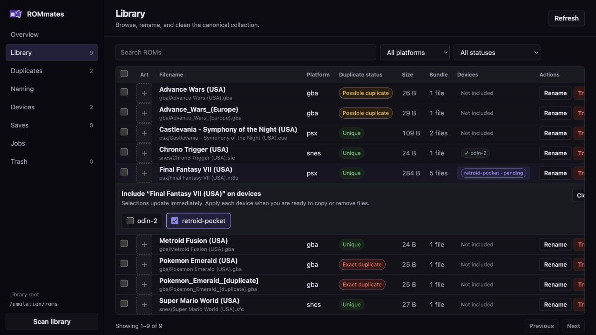
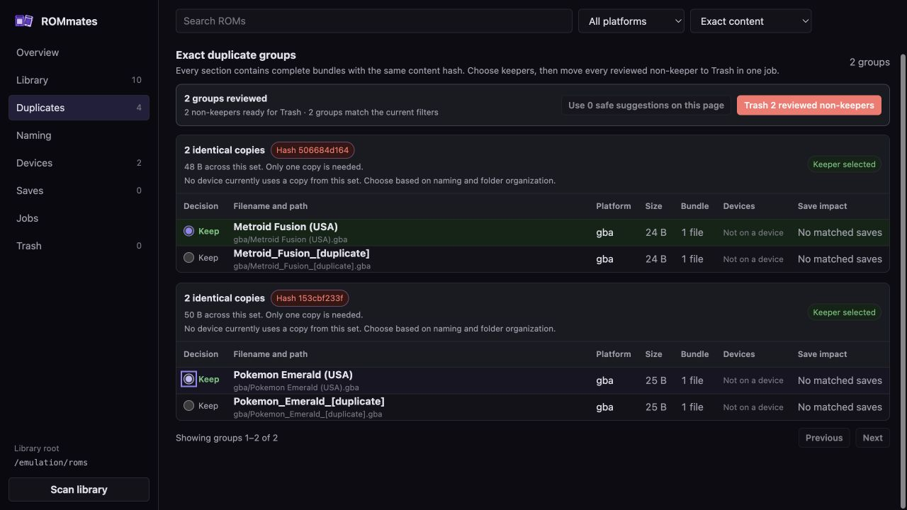
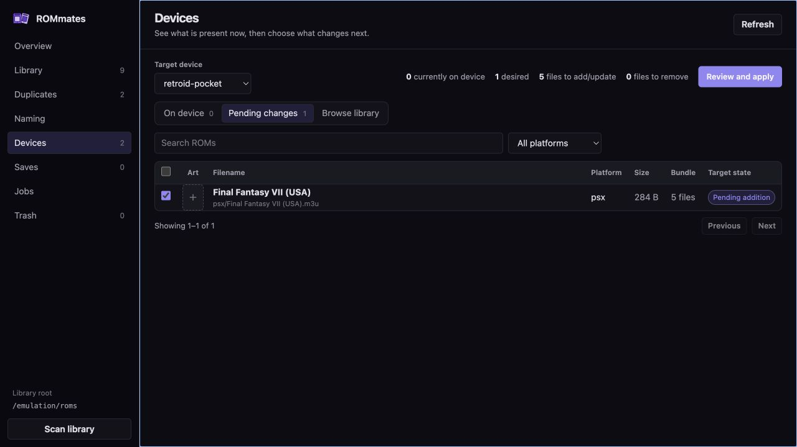

# ROMmates

ROMmates is a private, self-hosted web interface for cleaning a canonical ROM library and giving each handheld its own game roster. It deploys selected games into per-device ES-DE folders, while Syncthing continues to handle transport to each device.

## Screenshots

### Collection overview



### Library and device assignment



### Grouped duplicate review



### Device reconciliation



The MVP supports:

- At-a-glance collection dashboard with cleanup, device, save, artwork, and job health
- Indexed search across platform folders, backed by SQLite
- Compact filtering by platform and duplicate status
- SHA-256 exact duplicate detection
- Normalized-filename possible duplicate review
- Bundle-aware `.cue`, `.gdi`, and `.m3u` descriptor scanning, including unquoted GDI track filenames with spaces
- Complete folder bundles for directory-based platforms such as PS3
- Native `.3ds`, `.cci`, `.nsp`, `.xci`, and `.vpk` discovery
- Switch base-game indexing that excludes update title IDs and support trees such as updates, DLC, cheats, and mods
- Safe bundle rename with descriptor reference rewriting
- Reviewable naming suggestions from XML DAT catalogs and conservative filename cleanup
- Confidence filters, collision checks, editable proposals, and bulk bundle renaming
- Recoverable deletion, restoration, and explicit permanent deletion
- Bulk permanent deletion from Trash with one review and confirmation
- Resumable, chunked browser uploads on a dedicated Transfers screen
- Authenticated per-game downloads, with streamed ZIP output for multi-file bundles
- Cross-page duplicate keeper review with one confirmed batch move to recoverable Trash
- Per-device desired game selections and previewed reconciliation
- Actual device-directory inventory shown in device views and on each Library game row
- Per-game device assignment directly from the Library screen
- Inline device status tags showing synced, pending-add, and pending-remove assignments
- Automatic cleanup of `._*` and `.DS_Store` inside device ROM folders during apply
- Background jobs for scans, copies, renames, delete, restore, and purge operations
- Safe stop controls for scans and device deployment jobs
- Automatic infinite loading across library, device, duplicate, naming, save, snapshot, and job-issue results
- Detailed job reports with timing, structured results, and scroll-loaded unreadable-file paths
- Deduplicated RetroArch save snapshots with scheduling, retention, historical downloads, and guarded full-state restore
- Read-only RetroArch save-to-ROM matching, orphan detection, and rename impact warnings
- Snapshot-backed deletion of confirmed orphan save groups
- ScreenScraper matching with ratings, within-platform ranking, and locally cached artwork
- Bearer-token protection for the private API
- Browser/OS light and dark themes

## Expected directories

The server layout should look like:

```text
Emulation/
├── roms/
│   ├── gba/
│   ├── psx/
│   └── snes/
├── devices/
│   ├── retroid-pocket/
│   │   └── roms/
│   └── steam-deck/
│       └── roms/
└── .rommates-trash/
```

Every direct child of `devices` containing a `roms` directory is discovered as a device during a library scan.

## Deploy with Docker Compose

1. Copy this project to the Ubuntu server.
2. Create the deployment environment file:

   ```bash
   cp .env.example .env
   openssl rand -hex 32
   ```

   Put the generated value in `ROMMATES_ACCESS_TOKEN` and set `EMULATION_ROOT` to the absolute host directory containing `roms` and `devices`. Set `RETROARCH_CLOUD_ROOT` to the host directory that backs RetroArch's WebDAV cloud storage. ROMmates refuses to start when the token or Emulation root is missing.

3. Create the state and trash directories as the same Linux user that owns the ROM library:

   ```bash
   mkdir -p data data/save-snapshots /srv/Emulation/.rommates-trash
   ```

4. Set `PUID` and `PGID` in `.env` to the account that owns the Emulation directory. Find them with:

   ```bash
   id -u
   id -g
   ```

5. Build and start:

   ```bash
   docker compose up -d --build
   ```

6. Open `http://SERVER-IP:8080`, enter `ROMMATES_ACCESS_TOKEN`, and let the startup scan finish.

The token protects the application from unauthenticated and cross-site API requests. It is still intended for a trusted private network. Bind `ROMMATES_BIND=127.0.0.1` when placing it behind a reverse proxy.

The application refuses to start without a token, so a misconfigured launch fails loudly instead of exposing the API. If an authenticated reverse proxy already guards the app, set `ROMMATES_ALLOW_ANONYMOUS=true` to opt out deliberately.

If `RETROARCH_CLOUD_ROOT` is not set, Compose mounts an empty local directory at
`./data/retroarch-saves`. This keeps existing deployments compatible while the Saves UI
explains that no cloud files have arrived. The account selected by `PUID` and `PGID` needs
read/write access to both the WebDAV backing directory and `ROMMATES_DATA_ROOT`. Snapshot
blobs are stored beneath that data root in `save-snapshots`.

## RetroArch save snapshots

ROMmates treats RetroArch's WebDAV directory as the live source and stores immutable,
content-addressed versions under `/data/save-snapshots`. Unchanged files share a single SHA-256 blob,
so frequent snapshots only consume space for changed save data.

The **Saves** screen provides:

- Searchable current WebDAV files
- A Save matching review queue for orphaned, normalized-name, and ambiguous ROM matches
- Recoverable orphan cleanup that forces a full safety snapshot before deletion
- Manual snapshots with optional notes
- Scheduled snapshots and tiered recent, daily, weekly, and monthly retention
- Pinned snapshots that retention never removes
- Complete change previews against the live save tree
- Historical file downloads that do not alter WebDAV
- Full-tree restore with a mandatory pre-restore safety snapshot

Restores include RetroArch's server manifests, not only `.srm` and state files. Close
RetroArch on every device and allow the final cloud sync to finish before restoring. The
restore job verifies that live files still match the preview, stages and hashes every
historical file, creates a safety snapshot, and rolls the live directory back if the job
fails or is stopped during mutation.

## Syncthing ignores

Add these patterns to the Syncthing folder ignore list as another layer of protection:

```text
._*
.DS_Store
*.rommates-copy
*.rommanager-copy
*.rommates-link
```

## How device reconciliation works

Selections represent the desired managed set for a device. Each device can use independent
copies or prefer hardlinks. Applying changes:

1. Deploys missing or changed files from `/emulation/roms` to `/emulation/devices/{device}/roms`.
   Hardlink-preferred devices use a zero-additional-storage hardlink when the source and
   target are on the same underlying filesystem, with a safe copy fallback.
2. Removes previously managed files whose games were unselected.
3. Leaves unrelated, unmanaged files alone.
4. Removes Finder metadata and interrupted ROMmates temp files from the target device ROM tree.

Missing system directories are created automatically. ROMmates translates unambiguous
human-readable library folders to ES-DE's canonical, case-sensitive paths (for example,
`Nintendo Game Boy` to `gb` and `PlayStation` to `psx`) and preserves every nested bundle
path below them. Unknown or custom platform folders are preserved instead of guessed.

Each deployment is recorded as it lands, so an apply that fails or is interrupted partway leaves every file it already wrote under management. That record is an ownership boundary—not a cached claim that a file is a copy or hardlink. ROMmates derives the storage relationship from the source and destination inodes whenever it renders the device preview. Re-running the apply finishes the job, and unselecting a game still removes what was deployed.

Within `roms/switch`, packages in `update`, `updates`, `dlc`, `cheats`, `mods`, or
`firmware` trees are deliberately excluded from the game catalog. Root-level packages
whose Nintendo title ID ends in `800`, plus packages explicitly named `Update` or `UPD`,
are also treated as support content. Base `.nsp` and `.xci` packages remain selectable.

Changing a device from **Independent copies** to **Hardlinks preferred** makes the next
apply atomically replace eligible managed copies with hardlinks. The filename Syncthing
sees does not change. Removing the device entry only unlinks that entry; the canonical ROM
remains. ROMmates treats ROM content as immutable because permissions, timestamps, and
in-place writes are shared by every hardlink to the same inode.

For mergerfs pools, hardlinks require the device/platform directory to exist on the same
underlying branch as the canonical ROM. Configure the mergerfs mount with `func.mkdir=all`
and mirror existing `/devices/{device}/roms/{platform}` directories across the branches
once before converting. ROMmates falls back to an independent copy when the kernel returns
`EXDEV` or otherwise rejects a hardlink, so enabling the preference is safe before every
directory has been prepared.

Device apply jobs can be stopped from the header or Jobs screen. ROMmates checks for
cancellation between copy chunks, removes the current temporary partial file, and leaves
previously completed copies recorded for the next apply. Short atomic operations such as
rename, trash, restore, and purge are not interruptible once they begin.

Open **Jobs → Report** to inspect a run's status, duration, result counts, and every
unreadable file with its library-relative path and error reason. Scans created before
this feature may expose only the first 50 paths retained by that older version; the
report labels that limitation, and the next cached scan records the complete list.

## ScreenScraper metadata and artwork

ROMmates can match games with ScreenScraper and cache a cover, screenshot, and logo under
`/data/media`. Artwork belongs to the logical game bundle, so multi-track discs and
folder-based games receive one media set. Scrapes run as cancellable background jobs;
single-file ROMs use CRC32, MD5, SHA-1, and size before falling back to an unambiguous
exact-title match. Fingerprints and downloaded assets are reused by later jobs.

Matched games also cache ScreenScraper's community score on its documented 0–20 scale
and Staff Pick flag. Library and device views show the score and its rank among rated
games on the same platform. Choose a platform, then use **Fetch missing ratings** to run
a metadata-only job for every unrated game in that set; this does not download artwork.
The sort control supports best or lowest rating, title, and file size. Unrated games
always remain at the end of rating sorts.

For platform-wide coverage, configure a RAWG API key and open **Top 100 coverage** after
selecting a platform. ROMmates caches RAWG's highest Metacritic-ranked games, then marks
each title as owned, a possible filename match, or missing. Possible matches are shown
for review and never silently counted as owned. RAWG requires attribution, so every
ranking panel includes active links back to RAWG and the individual game pages.

ScreenScraper requires developer credentials issued for the application. Put these in
the same `.env` file as `EMULATION_ROOT`, then recreate the container:

```env
ROMMATES_SCREENSCRAPER_DEV_ID=your-developer-id
ROMMATES_SCREENSCRAPER_DEV_PASSWORD=your-developer-password
ROMMATES_SCREENSCRAPER_SOFTNAME=ROMmates
ROMMATES_SCREENSCRAPER_USER=your-optional-user-name
ROMMATES_SCREENSCRAPER_PASSWORD=your-optional-user-password
RAWG_API_KEY=your-rawg-api-key
```

ROMmates downloads ScreenScraper's current system list and maps common folder names such
as `gba`, `gbc`, `megadrive`, and `ps3`. Add numeric overrides for custom folder names as
a JSON object:

```env
ROMMATES_SCREENSCRAPER_SYSTEM_MAP={"my-gba-folder":12,"custom-system":123}
```

ROMmates follows ScreenScraper's account-specific API limits. Every request includes the
configured developer credentials and software name, and only one ScreenScraper request
stream can run at a time. Limits returned by the API are enforced for requests per minute,
requests per day, unmatched ROMs per day, and media download speed. The system catalog is
cached for 24 hours, while ROM fingerprints and artwork remain cached until their source
changes or you explicitly refresh them. Limit, closure, and blocked-client responses stop
the job with a specific error instead of being retried aggressively.

Select games in Library and choose **Find ratings and artwork**, or use the artwork tile on
one game. Clicking an existing cover performs an explicit refresh. Ambiguous name matches
and unmapped platforms are skipped and listed in the job report rather than guessed.

On the first run, existing files in a device directory are considered unmanaged and will not be deleted. Select matching games in the UI to bring them under management.

You can build the desired set in either direction:

- **Library:** Find a game, select its device count, and choose every device that should include it.
- **Devices:** Choose one device and select or unselect many games, then review and apply its pending changes.

Library assignments update the desired selections only. Open Devices and apply a target when you want ROMmates to change its filesystem.

## Scan safety

A scan reconciles the catalog with the filesystem, and removing a game also removes the
device selections and deployment records that depend on it. Because an unmounted or
still-mounting library volume is indistinguishable from an emptied one, a scan refuses to
continue when it would delete more than `ROMMATES_SCAN_PRUNE_LIMIT` (default 50%) of the
catalog. The job fails with an explanation, nothing changes, and the UI offers a
confirmation if you really did remove those files.

Device folders are pruned the same way: a device whose directory is gone is removed, but
a devices root that reports no devices at all is treated as unavailable rather than empty.

Files that cannot be read — including symlinks, which are never indexed — are counted and
named in the scan job detail instead of being dropped silently.

Disc descriptors (`.cue`, `.gdi`, and `.m3u`) are indexed with their referenced tracks as
one game. Dreamcast and PSX game folders claim every nested disc component, preventing
shared tracks or incomplete descriptor rows from becoming standalone games. Platforms
listed in `ROMMATES_FOLDER_BUNDLE_PLATFORMS` are indexed as one game per immediate child
folder, including every nested file; `ps3` and `wiiu` are enabled by default. Cartridge
collection folders remain file-based. A corrective scan automatically merges legacy
component rows into their logical bundle while preserving device selections and managed
deployment history.

Running scans can be stopped from the header or Jobs screen. Cancellation is cooperative:
ROMmates finishes the current filesystem checkpoint, preserves completed hash-cache batches,
and does not commit a partially reconciled catalog. A later scan resumes from those cached
hashes.

## Rename and delete safety

- Renaming a descriptor bundle renames its primary file and companion files whose names share the primary stem. It then rewrites references in `.cue` and `.m3u` files.
- Companion files with unrelated names remain unchanged but stay part of the bundle.
- Deleting atomically moves the entire indexed bundle into `.rommates-trash` and records its original paths. Library, device, and trash directories share one Emulation mount so the operation cannot degrade into an interruptible copy-and-delete.
- Deleting a canonical game also moves copies previously deployed by ROMmates into the same recoverable trash bundle. Restore puts both canonical and deployed copies back.
- Permanent deletion is available only from the Trash screen.
- Trash supports selecting any number of bundles and permanently deleting them in one background job.

Keep normal filesystem backups. Recoverable trash protects against UI mistakes, not disk failure or manual filesystem changes.

## Browser transfers

Open **Transfers** to upload a single ROM, a related set of files, or a complete game
folder. Data is written to a staging directory in bounded chunks, can resume after an
interruption when the same files are selected again, and is moved into the library only
after every declared byte arrives. Existing library paths are never overwritten. Folder
uploads follow the same descriptor and folder-bundle rules as the scanner, and archives
are stored as ROM files rather than extracted on the server.

Use **Download** beside a game in Library. The authenticated API creates a short-lived,
opaque download URL. Single-file games stream directly; multi-file games stream as an
uncompressed ZIP without first creating another full copy on disk. Download URLs expire
quickly and are revalidated against the indexed library before use.

## Naming suggestions

The Naming screen always offers conservative cleanup for obvious pack prefixes such as
`03.` and underscore-separated words. It does not guess capitalization or remove region,
language, revision, and disc metadata.

Import a No-Intro, Redump, or other Logiqx-style XML DAT and assign it to the matching
ROMmates platform for canonical suggestions. Suggestions have four confidence levels:

- **Exact DAT match:** a DAT-provided SHA-256 matches an indexed content file.
- **Strong name match:** the normalized current name uniquely matches one DAT entry for the platform and extension.
- **ScreenScraper title:** cached ScreenScraper metadata provides a localized canonical title.
- **Cleanup only:** only deterministic local formatting rules were applied.

DAT matches take precedence over ScreenScraper titles when both are available.

Many DAT files publish CRC, MD5, or SHA-1 but not SHA-256. Those catalogs still provide
strong filename matches; ROMmates does not label them exact without a verifiable SHA-256.
Suggested names remain editable. Colliding targets are disabled, and every batch is
validated again before any file changes. Applying suggestions uses the same bundle-aware
rename path as the Library screen, preserves device selections, updates descriptor
references, and carries hash-cache records to the new paths.

ROMmates also checks the live RetroArch `saves/` and `states/` trees before showing a
rename. Exact content filenames are matched first, with the core directory used to narrow
platforms when possible. Normalized-name matches are explicitly marked as possible or
ambiguous. Save matching is read-only: a ROM rename never silently renames or deletes save
data. “Select all” on the Naming screen skips games with matched save data by default;
individual affected games can still be selected after reviewing the warning.

The Save matching screen permits deletion only for groups with no ROM candidate. ROMmates
revalidates the match and filesystem metadata in the background, publishes a forced safety
snapshot, then removes the live files. Possible and ambiguous groups cannot be deleted.
Duplicate and ROM trash confirmations list matching save filenames that would be orphaned.

## Configuration

| Variable | Default | Purpose |
|---|---:|---|
| `ROMMATES_LIBRARY_ROOT` | `/emulation/roms` in Compose | Canonical platform-folder library |
| `ROMMATES_DEVICES_ROOT` | `/emulation/devices` in Compose | Parent of device directories |
| `ROMMATES_TRASH_ROOT` | `/emulation/.rommates-trash` in Compose | Recoverable deleted bundles |
| `ROMMATES_UPLOAD_ROOT` | `/emulation/.rommates-uploads` in Compose | Staging area for incomplete browser uploads; must be outside the ROM library |
| `ROMMATES_UPLOAD_MAX_BYTES` | `137438953472` (128 GiB) | Maximum declared size of one upload session |
| `ROMMATES_UPLOAD_CHUNK_BYTES` | `8388608` (8 MiB) | Maximum body size of each resumable upload request |
| `ROMMATES_UPLOAD_EXPIRY_HOURS` | `24` | Age after which abandoned staged uploads are removed |
| `ROMMATES_DOWNLOAD_TICKET_SECONDS` | `300` | Lifetime of an opaque game download URL |
| `ROMMATES_DATABASE_PATH` | `/data/rommates.db` | SQLite catalog and selections |
| `ROMMATES_SCAN_ON_START` | `true` | Start a background scan at boot |
| `ROMMATES_REQUIRE_EXISTING_ROOTS` | `true` in Compose | Fail startup instead of silently creating missing mounts |
| `ROMMATES_ACCESS_TOKEN` | **required** | Token entered in the browser and sent as a Bearer credential. Startup fails if it is missing or under 16 characters |
| `ROMMATES_ALLOW_ANONYMOUS` | `false` | Disables the token check. Only for instances already behind an authenticated reverse proxy |
| `ROMMATES_SCAN_PRUNE_LIMIT` | `0.5` | Largest share of the catalog one scan may delete without confirmation |
| `ROMMATES_EXTENSIONS` | built-in list | Optional comma-separated extension override |
| `ROMMATES_FOLDER_BUNDLE_PLATFORMS` | `ps3,wiiu` | Comma-separated platforms where each immediate child directory is one game bundle |
| `ROMMATES_RAWG_API_KEY` / `RAWG_API_KEY` | empty | Optional RAWG key for cached per-platform Top 100 Metacritic coverage; the prefixed name takes precedence |

## Local development

```bash
python3 -m venv .venv
.venv/bin/pip install -e '.[dev]'
ROMMATES_LIBRARY_ROOT=/tmp/roms \
ROMMATES_DEVICES_ROOT=/tmp/devices \
ROMMATES_TRASH_ROOT=/tmp/rommates-trash \
ROMMATES_DATABASE_PATH=/tmp/rommates.db \
ROMMATES_ACCESS_TOKEN=development-token-123456 \
.venv/bin/uvicorn app.main:app --reload --port 8080
```

Run the filesystem and API tests with:

```bash
.venv/bin/python -m pytest
```

## Updating the NUC with Git

After the repository has a remote, clone it on the NUC once. For later updates:

```bash
git pull --ff-only
docker compose up -d --build
```

Keep `.env`, `data/`, and the ROM library outside Git. Database migrations run automatically when the updated container starts.

## Upgrading from ROM Manager

Existing deployments upgrade in place. ROMmates accepts the previous `ROM_*` environment variables, migrates the default `rommanager.db` database and `.rommanager-trash` directory, cleans up legacy copy-temp files, and moves the saved browser token to the new key. New configuration should use the `ROMMATES_*` names above.

For the rename release, update the remote and remove the old Compose service once:

```bash
git remote set-url origin https://github.com/ryanho87/rommates.git
git pull --ff-only
docker compose -p rommanager down --remove-orphans
docker compose up -d --build
```

Later releases only need the normal `git pull` and `docker compose up` commands.
